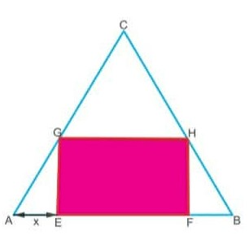

# 📐 Optimiseur — Rectangle EFGH de surface maximale

> Application web interactive pour visualiser et optimiser la surface d'un rectangle inscrit dans un triangle équilatéral —
> **TP2 Optimisation** (Terminale / CPGE).



---

## 🎯 Contexte mathématique

Une personne possède un terrain en forme de **triangle équilatéral ABC de 100 m de côté**. On souhaite y construire une maison rectangulaire **EFGH** dont la façade repose sur le côté [AB], de sorte que sa surface soit **maximale**.

**Problème :** Trouver la valeur de `x = AE = BF` qui maximise l'aire du rectangle EFGH.

### Formule de la surface

```
S(x) = √3 · (100 − 2x) · x      x ∈ ]0, 50[
```

### Dérivée et optimum

```
S'(x) = √3 · (100 − 4x)
S'(x) = 0  ⟹  x = 25 m
```

| Paramètre | Valeur optimale |
|-----------|----------------|
| x = AE = BF | **25 m** |
| Largeur EF | **50 m** |
| Hauteur GE | **≈ 43.3 m** |
| Surface S(x) | **≈ 2 165 m²** |

---

## ✨ Fonctionnalités

- **Slider interactif** — fait varier `x` de 1 à 49 m en temps réel
- **Visualisation géométrique** — triangle ABC avec rectangle EFGH animé, repères A B C E F G H, cotes et étiquettes dynamiques
- **Rectangle fantôme** — affiche en pointillés la configuration optimale pendant l'exploration
- **Sparkline S(x)** — mini-courbe de la fonction en bas du canvas avec point courant
- **Panneau de dimensions** — toutes les mesures mises à jour en direct (x, EF, GE, S)
- **Bouton ⭐ Optimal** — positionne automatiquement x = 25 m et affiche la démonstration
- **Mode sombre** — adapté automatiquement selon les préférences système
- **100 % responsive** — bureau, tablette, mobile

---

## 🖥️ Aperçu de l'interface

```
┌─────────────────────────────────────────────────────┐
│  Rectangle EFGH — Surface maximale   TP2·Optim.     │  ← Topbar
├──────────────────┬──────────────────────────────────┤
│  PARAMÈTRE       │  [ x ]  [ EF ]  [ S(x) ★ ]      │
│  ────────────    │  ┌────────────────────────────┐  │
│  Slider x ──●── │  │         Canvas              │  │
│                  │  │    △ ABC  +  ▭ EFGH         │  │
│  DIMENSIONS      │  │    Sparkline S(x)           │  │
│  x = AE   25 m  │  └────────────────────────────┘  │
│  EF       50 m  │                                   │
│  GE       43 m  │                                   │
│  S(x)  2165 m²  │                                   │
│                  │                                   │
│  FORMULE         │                                   │
│  S(x)=√3(100-2x)x│                                  │
│                  │                                   │
│  [⭐ Optimal]    │                                   │
│  [↺ Réinitialiser│                                   │
└──────────────────┴──────────────────────────────────┘
```

---

## 🚀 Utilisation

### Lancement local

Aucune dépendance, aucun serveur requis. Ouvrir directement dans le navigateur :

```bash
# Cloner le dépôt
git clone https://github.com/votre-utilisateur/triangle-rectangle-optimizer.git
cd triangle-rectangle-optimizer

# Ouvrir dans le navigateur
open index.html          # macOS
xdg-open index.html      # Linux
start index.html         # Windows
```

### Via un serveur local (optionnel)

```bash
# Python 3
python -m http.server 8080

# Node.js (npx)
npx serve .
```

Puis ouvrir `http://localhost:8080`.

---

## 📁 Structure du projet

```
triangle-rectangle-optimizer/
├── index.html          # Application complète (HTML + CSS + JS)
└── README.md           # Ce fichier
```

> L'application est entièrement contenue dans un **seul fichier HTML autonome** — pas de dépendances locales, pas de build.

---

## 🛠️ Stack technique

| Composant | Détail |
|-----------|--------|
| HTML / CSS / JS | Vanilla — aucun framework |
| Canvas API | Rendu géométrique 2D |
| Google Fonts | DM Serif Display · DM Mono · Instrument Sans |
| CSS Grid | Mise en page deux colonnes responsive |
| CSS Variables | Thème clair / sombre, dimensions canvas |
| `devicePixelRatio` | Rendu net sur écrans Retina / HiDPI |

---

## 📐 Logique du canvas

Le canvas utilise des **dimensions logiques fixes** définies via variables CSS (`--cvW`, `--cvH`). Les breakpoints adaptent ces variables selon le terminal — le JavaScript lit `offsetWidth/offsetHeight` sans jamais recalculer la mise en page.

```
Bureau   → 480 × 300 px
Tablette → 400 × 250 px  (≤ 900 px)
Mobile L → 340 × 215 px  (≤ 720 px)
Mobile S → 100vw × 220 px (≤ 580 px)
```

---

## 🎓 Objectifs pédagogiques

Ce TP illustre les notions suivantes :

- **Modélisation** — traduction d'une contrainte géométrique en fonction d'une variable
- **Dérivation** — calcul de S'(x) et recherche du zéro
- **Tableau de variations** — étude du signe de S'(x) sur ]0, 50[
- **Optimisation** — identification et justification du maximum global

---

## 📄 Licence

MIT — libre d'utilisation, de modification et de distribution.
